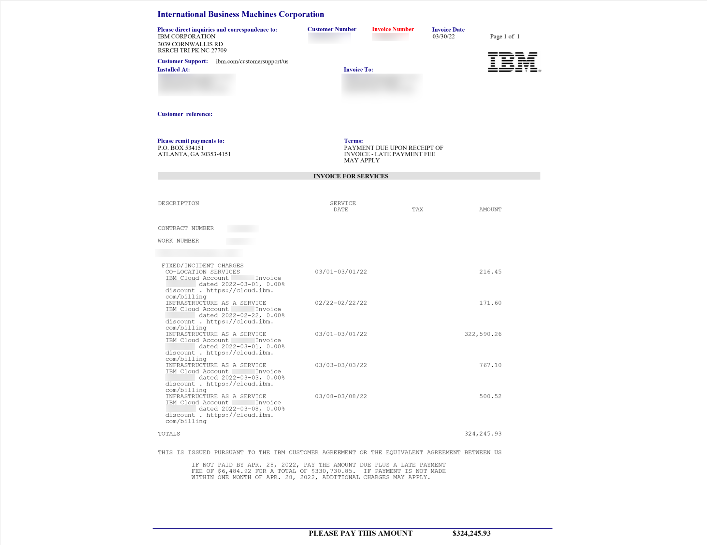
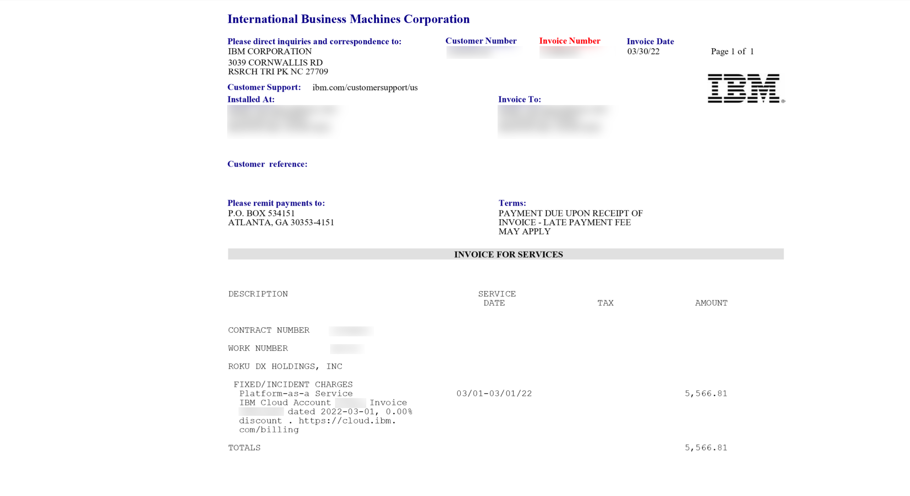

---

copyright:
  years: 2022
lastupdated: "2022-08-29"

keywords: invoice reconciliation, non-subscription invoice, map invoice, map usage, one time charges, recurring invoice, 

subcollection: billing-usage

---

{:shortdesc: .shortdesc}
{:codeblock: .codeblock}
{:tip: .tip}
{:screen: .screen}
{:note: .note}
{:term: .term}
{:external: target="_blank" .external}

# Reconciling usage for nonsubscription multi-year account invoices 
{: #reconcile-invoice}

As an {{site.data.keyword.cloud}} customer with a nonsubscription multi-year account, understanding the different invoices that are available to you can help understand your monthly cost breakdown. The final monthly invoice and recurring invoice charges provide granular service-level usage detail that can be used for usage auditing and can be found on the [Invoices page](/billing/invoices) in the {{site.data.keyword.cloud_notm}} console.

The examples in this document use fictitious invoices and usage reports to help guide you through the process of understanding the itemized charges on your official invoices. Reference the images as a guide to identify the documents you need to accurately map official and unofficial invoices.
{: note} 

## Identifying the two types of charges on the official invoice 
{: #invoice-identify}

The official invoice that you receive at the end of the month includes the following two charges:

1. New and one-time charges
   * New and one-time charges from the 20th of the prior month to the 19th of the current month. For the examples referenced in this document, the new and one-time charges are from 20 February to 20 March for the official invoice received at the end of March.

2. The recurring charges in the {{site.data.keyword.cloud_notm}} console.
 
The total of your official invoices for each month match the sum of these two charges. 
{: note}

### Understanding the invoice examples 
{: #image-summary} 

* [Figure 1](/docs/billing-usage?topic=billing-usage-reconcile-invoice#IaaS-PaaS): The official Infrastructure as a Service (IaaS) and platform as a Service (PaaS) invoices for March. This invoice is sent to the email associated with the account. 
* [Figure 2](/docs/billing-usage?topic=billing-usage-reconcile-invoice#unofficial-invoice): The unofficial March recurring invoice. You can find your unofficial recurring invoice on the [Invoices page](/billing/invoices). 
* [Figure 3](/docs/billing-usage?topic=billing-usage-reconcile-invoice#new-charges): A view of the invoice tab in the console for the new and one-time charges from 20 February to 19 March. 

You must be the account owner or have the administrator role or higher on the billing and usage service to view the billing information on the invoice tab. 
{: tip} 

### Review the totals on the official monthly invoices 
{: #recurring-charge}

You receive an official IaaS and PaaS invoice each month. 

For this example, reference Figure 1. The IaaS invoice total is $324,245.93 USD and the PaaS invoice total is $5566.81 USD. To understand what these totals represent, you must look at your unofficial invoice. The unofficial invoice provides a line item breakdown of each charge. 

{: caption="Figure 1.IaaS and PaaS official invoice for the month of March." caption-side="bottom"} 
{: caption="Figure 1.IaaS and PaaS official invoice for the month of March." caption-side="bottom"} 
{: #IaaS-PaaS}

### Identify the charges from the unofficial monthly invoices
{: #iaas-charges}

Figure 2 represents the unofficial invoice. To locate your unofficial invoice, complete the following steps:

1. In the {{site.data.keyword.cloud_notm}} console, go to **Manage** > **Billing and usage**, and select **Invoices**.
1. Click the invoice number. For this example, review the table and click the invoice with a 3/1/22 date of issue and recurring type. 
1. To download a copy of the unofficial invoice, click the **Download** icon  and select Excel invoice.
1. Click **Email selected documents**. You receive an email with the selected documents to the email address of the account that you're logged in to.
1. Open the downloaded file, and click **Summary** tab. 

In this example, the Platform Services charge matches the total of the PaaS official invoice from Figure 1: $5,566.81 USD. The remaining charges on the unofficial invoice, which totals $322,806.71 USD ($328,373.52 - $5566.81 = $322,806.71) represent the remaining infrastructure, nonplatform charges from this recurring invoice. 

{: caption="Figure 2.IaaS charges from the recurring, Unofficial invoice the month of March." caption-side="bottom"} 
{: #unofficial-invoice}

### Identify the new and one-time charges 
{: #new-onetime-charge}

Next, you need to identify and find the sum of the new and one time charges. Your new and one-time charges are on the [Invoices page](/billing/invoices) in the console. There are three new charges on the invoices page during this time period: A charge of $500.52, $767.10, and $171.60.

{: caption="Figure 3. New and one-time charges in the console for the month of March." caption-side="bottom"}
{: #new-charges}

The remaining infrastructure charges of $322,806.71 USD on the unofficial invoice and the new and one-time charges should add up to the total official Infrastructure invoice charge of $324,245.93 USD.

### Understanding the line item charges on your official invoice 
{: #understand-line-item-charges}

Now that we confirmed that the official invoice totals match the unofficial recurring and new and one time charges, let’s find out what the charges from the official invoice represent. 

On the Excel version of your unofficial recurring invoice that you downloaded in step 2, click the **Detailed Billing** tab. The Detailed Billing tab provides a breakdown of all of your infrastructure and platform charges. They represent three major types of usage: 

* In Advance (for example, the month of March) infrastructure monthly usage charges. These are recurring charges that you incur until you cancel the service. The charge is the same every month. 

{: caption="Figure 4. In advance infrastructure monthly usage charges." caption-side="bottom"}
 
* In Arrears (for example, the month of February) infrastructure hourly charges. These are usage-based charges from the previous month. Note the `672 hrs * .066` format of the charges. In arrears, infrastructure hourly charges are always in this format.

{: caption="Figure 5.In Arrears infrastructure hourly charges." caption-side="bottom"}

* In arrears (for example, the month of January) platform service charges. These are usage-based charges from two months prior. They are labeled Platform service in column B and reference the month in which the usage was consumed. 

{: caption="Figure 6. In arrears platform service charges for the month of January." caption-side="bottom"}
